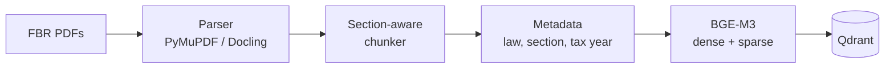
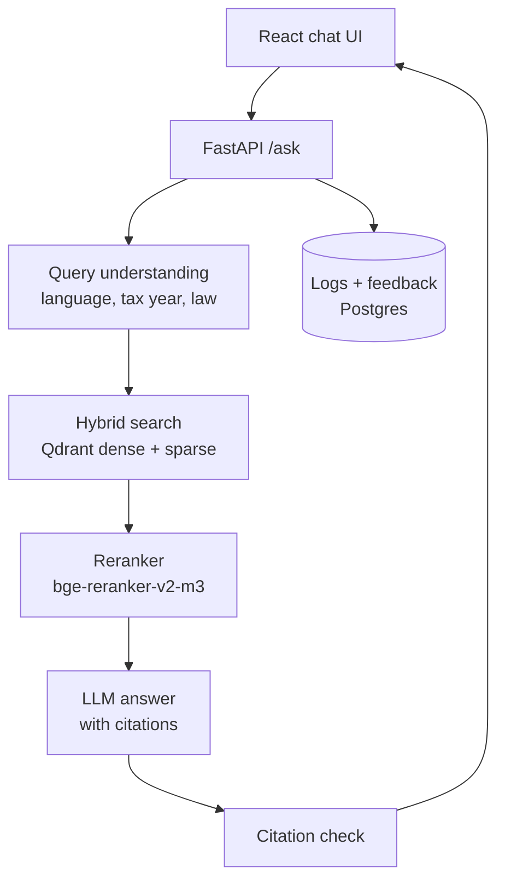

# Mahsool AI — Pakistan Tax Q&A Project Plan

Owner: Hamza · Plan date: 2026-09-25

## Overview

Mahsool AI (محصول = tax/revenue) answers Pakistani tax questions in English, Urdu and Roman Urdu. Every answer cites the exact section, rule or SRO it comes from, and the assistant says "I don't know" when the law doesn't cover the question.

**Who it's for**

- Salaried people: "Mera tax kitna katega 1.5 lakh salary pe?"
- Freelancers and IT exporters: tax on foreign remittances, PSEB registration benefits
- Small business owners: sales tax registration, withholding on purchases
- Tax practitioners and students: fast lookup of sections and their amendment history

**What makes it stand out**

- **Cross-language RAG:** an Urdu or Roman Urdu question has to find English legal text.
- **Law versioning:** tax law changes every Finance Act, so answers are tied to the tax year asked about.
- **Measured quality:** a published evaluation set with accuracy and citation scores.
- **Full product:** ingestion pipeline, API, React UI, deployment and monitoring.

**Success targets for v1**

| Metric | Target |
| --- | --- |
| Correct answer on the test set | ≥ 85% |
| Answers with a correct citation | ≥ 90% |
| Correct refusal on out-of-scope questions | ≥ 90% |
| Retrieval Recall@5 (Urdu / Roman Urdu questions) | ≥ 80% |
| Median response time | < 4 s |
| Monthly running cost | < 2,000 PKR (free tiers where possible) |

## Scope: all FBR laws, added in 4 phases

The final product covers every federal tax law FBR publishes, loaded in phases so a working product exists after phase 1. Every phase reuses the same pipeline; each new law is mostly a data/config job.

| Phase | Documents | Why this order |
| --- | --- | --- |
| 1 (MVP) | [Income Tax Ordinance 2001](https://download1.fbr.gov.pk/Docs/2026226162211364IncomeTaxOrdinance2001-Amended-20.02.2026.pdf), [Income Tax Rules 2002](https://www.fbr.gov.pk/categ/income-tax-rules-2002/335), [Withholding Tax Rate Card TY2027](https://download1.fbr.gov.pk/Docs/202681113864992WithholdingTaxRatesCard2027.pdf) | Most user questions: salary tax, filer status, withholding, returns |
| 2 | [Sales Tax Act 1990](https://www.fbr.gov.pk/categ/sales-tax-act/301), [Sales Tax Rules 2006](https://www.fbr.gov.pk/categ/sales-tax-rules-2006/302), [Special Procedures Rules 2007](https://www.fbr.gov.pk/categ/sales-tax-special-procedures-rules-2007/304), [ICT (Tax on Services) Ordinance 2001](https://www.fbr.gov.pk/categ/islamabad-capital-territory-tax-on-services/771) | Business owners and registration questions |
| 3 | [Federal Excise Act 2005](https://www.fbr.gov.pk/Categ/Federal-Excise-Act/346), [Federal Excise Rules 2005](https://www.fbr.gov.pk/categ/federal-excise-rules-2005/347), [Customs Act 1969](https://www.fbr.gov.pk/categ/customs-act-1969/130), [Customs Rules 2001](https://download1.fbr.gov.pk/Docs/2023102014103110714Customs-Rules-SRO-450(I)-2001.pdf) | Importers, excise-heavy sectors; longer, more technical texts |
| 4 | [Finance Acts](https://www.fbr.gov.pk/Categ/Finance-Acts/620), SROs, circulars, Tax Laws (Amendment) Ordinances | Amendment history for "what was the rule in tax year X" and FBR clarifications |

**Out of scope:** provincial sales tax on services (PRA, SRB, KPRA, BRA), the full customs tariff (PCT codes), and case law.

**Tax-year note:** the Finance Act 2026 took effect on 1 July 2026 (tax year 2027). Phase 1 must use FBR's latest consolidated Ordinance. The copy linked above is amended up to 20 Feb 2026, so check FBR's [Income Tax Ordinance page](https://www.fbr.gov.pk/Categ/Income-Tax-Ordinance/326) for a post-budget version before ingesting.

## System architecture

Two parts: an offline ingestion pipeline that turns FBR PDFs into searchable chunks, and an online API that answers questions.

**Ingestion (runs once per law, and again after each Finance Act)**



**Answering a question**



Query understanding rewrites Urdu and Roman Urdu into English search queries. The citation check drops any answer whose cited section wasn't in the retrieved text.

## Data pipeline

Chunks follow the law's own structure (section, sub-section, schedule clause), never fixed-size windows. This is what makes precise citations possible.

1. **Collect:** download each PDF from FBR, save with version date and checksum. Re-running skips unchanged files.
2. **Parse:** PyMuPDF for body text; Docling for tables such as the First Schedule rate tables. Strip page headers, footers and page numbers.
3. **Split footnotes:** FBR PDFs mark amendments in footnotes ("Substituted by the Finance Act, 2025"). Extract and attach them to their section as `amended_by`.
4. **Chunk by structure:** detect Part → Chapter → Section → Sub-section with regex on patterns like `149. Salary.—` and `(1)`. One section = one chunk. Sections over ~800 tokens split at sub-sections, with the section title repeated at the top of each piece.
5. **Tables and schedules:** each rate table becomes its own chunk in markdown. Each Second Schedule exemption clause is its own chunk.
6. **Tag metadata:** law, section number, title, schedule and clause, tax years it applies to, source URL and page.
7. **Embed and index:** BGE-M3 dense and sparse vectors into Qdrant, one collection for all laws, filtered by metadata.

**Chunk example**

```json
{
  "chunk_id": "ITO2001-s149-1",
  "law": "Income Tax Ordinance, 2001",
  "law_code": "ITO",
  "section": "149",
  "subsection": "(1)",
  "title": "Salary",
  "text": "Every employer paying salary to an employee shall...",
  "amended_by": ["Finance Act, 2025"],
  "tax_year_from": 2026,
  "tax_year_to": null,
  "source_url": "https://download1.fbr.gov.pk/...",
  "page": 412,
  "version_date": "2026-02-20"
}
```

**Versioning:** each new consolidated version is ingested as a new snapshot, not an overwrite. A question about tax year 2025 searches only chunks valid for 2025.

**Urdu glossary:** a hand-built file of 200–300 terms (e.g. filer = active taxpayer, katoti = withholding, ATL = Active Taxpayers List). Query rewriting uses it.

## Retrieval and the Urdu problem

Search with both the user's original words and an English rewrite, combine keyword and semantic search, then rerank.

1. **Detect the language:** Urdu script, Roman Urdu or English (script check + rewrite step).
2. **Rewrite the query:** a small, fast LLM (GPT OSS 20B on Groq) turns the question into 1–3 English legal search queries using the glossary, and extracts tax year and likely law. Example: "freelancer ko bahar se paisa aye to kitna tax" → "tax on foreign remittance for IT export services, freelancer, PSEB".
3. **Direct lookup:** if the question names a section ("section 236K", "dafa 149"), fetch it by ID before searching.
4. **Hybrid search:** in Qdrant, dense vectors for meaning, sparse vectors for exact terms. Run for original and rewritten queries, merge with reciprocal rank fusion (RRF).
5. **Filter:** by tax year and, when detected, by law.
6. **Rerank:** top 30 through bge-reranker-v2-m3; best 5–8 go to the answer step.

**Ablation study** — measure Recall@5 on Urdu and Roman Urdu test questions after each step:

| Setup | Recall@5 |
| --- | --- |
| Dense only, original query | |
| + sparse (hybrid) | |
| + English query rewrite | |
| + reranker | |
| + glossary in rewrite | |

## Answer generation and guardrails

The LLM may only use retrieved sections, must cite each claim, and must refuse when the sections don't answer the question.

- **Model:** GPT OSS 120B on Groq for answers; GPT OSS 20B for query rewriting ([Groq models](https://console.groq.com/docs/models)). Model IDs live in config, not code.
- **Grounded prompt:** retrieved chunks are numbered `[1]`, `[2]`… and every sentence of the answer ends with one of those numbers.
- **Structured output:** JSON with `answer`, `citations` (chunk IDs), `confidence`, `language`. The UI renders each citation as a clickable card (law, section, original text).
- **Citation check:** code confirms each cited ID was retrieved. Invalid citations are removed; if none remain, the app refuses.
- **Refusals:** "I couldn't find this in the tax laws I cover" for out-of-scope or low-confidence questions, in the user's language.
- **Reply language:** same as the question; legal terms stay in English with an Urdu explanation.
- **Tax year:** if none given, assume the current one (TY2027) and say so.
- **Disclaimer under every answer:** "For information only, not tax advice. Confirm with a tax practitioner or FBR."
- **Safety:** Prompt Guard on Groq screens inputs for prompt injection; rate limiting per IP.

## Tech stack

| Layer | Choice | Why |
| --- | --- | --- |
| PDF parsing | PyMuPDF + Docling | Fast text; Docling handles tables |
| Embeddings | BGE-M3 | 100+ languages, 8,192-token input, dense + sparse from one model |
| Reranker | bge-reranker-v2-m3 | Multilingual, pairs with BGE-M3 |
| Vector DB | Qdrant (local Docker; Cloud free tier in prod) | Native hybrid search and metadata filters |
| LLM | GPT OSS 120B / 20B on Groq | Fast and cheap |
| Backend | FastAPI + Pydantic | Async, auto docs, typed JSON |
| Frontend | React + Vite + Tailwind | Chat UI with citation cards |
| Logs and feedback | PostgreSQL (Neon or Supabase free tier) | Questions, answers, thumbs up/down |
| Tracing | Langfuse | Per-step input, output, latency |
| Evaluation | Ragas + own scripts | Faithfulness, correctness, Recall@k |
| Deployment | Docker; backend on Hugging Face Spaces, frontend on Vercel | Free, visible portfolio links |
| CI | GitHub Actions | Tests + small eval on every push |

Alternative for the ablation: Qwen3-Embedding-0.6B as a second embedding model.

## Features

**MVP (phase 1)**

- Chat in English, Urdu and Roman Urdu, with streamed answers
- Citation cards: law, section, title, original text, link to the FBR PDF page
- Tax-year selector (defaults to TY2027)
- "Show sources" panel listing retrieved sections with scores
- Thumbs up/down on every answer, saved to the database
- Suggested starter questions for salaried people, freelancers and businesses
- Public evaluation page showing latest test-set scores

**Version 2 (after phases 2–4)**

- Law filter: Income Tax, Sales Tax, Federal Excise, Customs
- Salary tax calculator that uses the rate table and cites it
- "What changed this year" view comparing a section across Finance Acts
- Urdu voice questions with Whisper on Groq
- Section browser
- Shareable answer links
- Admin page: upload a new FBR PDF, re-index, re-run evals

## Evaluation

A 200-question test set with known correct sections is built before any tuning.

| Group | Questions | Notes |
| --- | --- | --- |
| English | 90 | From real sections; easy lookups + multi-section questions |
| Urdu script | 40 | Translations + naturally phrased questions |
| Roman Urdu | 40 | How people type: "filer na ho to kya hoga" |
| Out of scope / trick | 30 | Provincial tax, made-up sections, non-tax; correct answer is a refusal |

Each question stores: question, language, gold section IDs, short reference answer, difficulty tag.

**Split:** 60 dev (tuning), 140 test (held out). Report only test-set numbers publicly.

| Metric | What it checks | How |
| --- | --- | --- |
| Recall@5, MRR | Retrieval found the right section | Compare with gold section IDs |
| Answer correctness | Answer is right | LLM judge; 50 checked by hand |
| Faithfulness | Claims backed by sources | Ragas |
| Citation accuracy | Citations point to right sections | Script |
| Refusal accuracy | Refuses trick questions, answers real ones | Script |
| Latency p50/p95, cost per question | Usable and cheap | Langfuse traces |

**In CI:** a 30-question subset runs on every push; the build fails if Recall@5 drops by more than 5 points versus the stored baseline.

## Build schedule

| Week | Dates | Goal | Done when |
| --- | --- | --- | --- |
| 1 | 28 Sep – 4 Oct | Repo setup; parse and chunk the Income Tax Ordinance; start the test set | Every ITO section is a clean JSON chunk; 90 English questions |
| 2 | 5 – 11 Oct | Rules 2002 + rate card; embed into Qdrant; Urdu + Roman Urdu questions | Baseline Recall@5 on all 200 questions |
| 3 | 12 – 18 Oct | Query rewrite, hybrid search, reranker; FastAPI `/ask` with citation check | Ablation table filled; API returns cited JSON |
| 4 | 19 – 25 Oct | React chat UI, citation cards, feedback, Postgres logs, Langfuse | Full flow works locally |
| 5 | 26 Oct – 1 Nov | Fix top eval failures; Docker; deploy; README; demo video | Live link works; LinkedIn post 1 |
| 6 | 2 – 8 Nov | Phase 2: Sales Tax Act, Rules, ICT services ordinance | Sales tax questions pass targets |
| 7 | 9 – 15 Nov | Phase 3: Federal Excise and Customs | Law filter in UI; test set covers 4 laws |
| 8 | 16 – 22 Nov | Phase 4: Finance Acts, SROs, circulars; tax-year versioning | "What changed" works for 10 sample sections |
| 9 | 23 – 29 Nov | v2: salary calculator, Urdu voice, shareable links | Features live |
| 10 | 30 Nov – 6 Dec | Full re-evaluation; practitioner review; polish | Eval page updated; LinkedIn post 2 |

## Repo structure

```
mahsool-ai/
├── backend/
│   ├── app/
│   │   ├── main.py              # FastAPI app
│   │   ├── config.py            # settings from .env (pydantic-settings)
│   │   ├── api/ask.py           # /ask, /feedback routes
│   │   ├── rag/
│   │   │   ├── query_rewrite.py # language detect, rewrite, tax year
│   │   │   ├── retriever.py     # hybrid search + RRF
│   │   │   ├── reranker.py
│   │   │   ├── generator.py     # prompt + structured output
│   │   │   └── citations.py     # citation check
│   │   ├── models/schemas.py    # Pydantic models
│   │   └── db/                  # Postgres logs + feedback
│   ├── tests/
│   └── Dockerfile
├── ingestion/
│   ├── download.py              # fetch FBR PDFs + checksums
│   ├── parse.py                 # PyMuPDF / Docling
│   ├── chunk.py                 # section-aware chunker
│   ├── laws/                    # one config per law (regex, metadata)
│   └── index.py                 # BGE-M3 -> Qdrant
├── eval/
│   ├── testset.jsonl            # 200 questions with gold sections
│   ├── run_eval.py
│   └── reports/                 # dated results + ablation charts
├── frontend/                    # React + Vite + Tailwind
├── data/glossary_ur.csv         # Urdu / Roman Urdu tax glossary
├── docs/                        # architecture, decisions, learning notes
├── .github/workflows/ci.yml
├── docker-compose.yml           # Qdrant + Postgres + backend locally
└── README.md
```

## Risks and mitigations

| Risk | Impact | Mitigation |
| --- | --- | --- |
| FBR PDFs have broken layouts, scanned pages, odd footnotes | Bad chunks, wrong citations | Per-law parser configs; spot-check 20 random chunks per law; OCR only where needed |
| Confidently wrong answer | User loses money; credibility hit | Strict grounding, citation check, refusals, disclaimer |
| Law changes after a Finance Act or SRO | Outdated answers | Version snapshots, version date on every citation, re-ingest script |
| Roman Urdu spelling varies a lot | Poor retrieval | Query rewrite + glossary + measure on the Roman Urdu group |
| Free-tier limits (Groq, Qdrant, sleeping Space) | Demo fails for a recruiter | Cache common answers; keep-alive ping; demo video fallback |
| Scope creep from "all FBR laws" | MVP never ships | Phase 1 ships first; later phases only after targets are met |
| BGE-M3 + reranker too heavy for free CPU | Slow answers | Quantized ONNX versions or hosted embedding API as backup |

## Sources

- [FBR — Acts, Ordinances and Rules](https://www.fbr.gov.pk/act-rules-ordinances/131226)
- [FBR — Income Tax Ordinance 2001, amended up to 20 Feb 2026 (PDF)](https://download1.fbr.gov.pk/Docs/2026226162211364IncomeTaxOrdinance2001-Amended-20.02.2026.pdf)
- [FBR — Withholding Tax Rate Card, TY2027 (PDF)](https://download1.fbr.gov.pk/Docs/202681113864992WithholdingTaxRatesCard2027.pdf)
- [GroqCloud supported models](https://console.groq.com/docs/models)
- [BentoML — open-source embedding models in 2026](https://www.bentoml.com/blog/a-guide-to-open-source-embedding-models)
