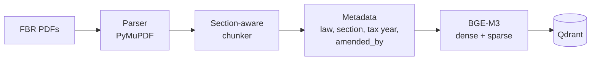
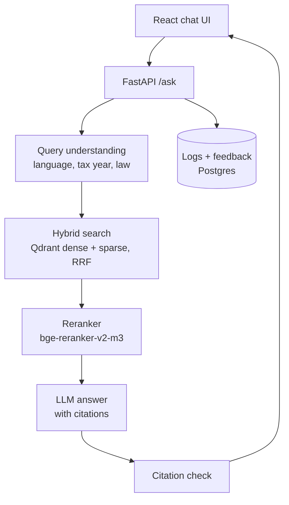

# Mahsool AI — محصول

**Cross-lingual RAG assistant for Pakistani tax law (FBR) — English, Urdu & Roman Urdu with section-level citations.**

Ask *"Mera tax kitna katega 1.5 lakh salary pe?"* or *"freelancer ko bahar se paisa aye to kitna tax?"* and get an
answer grounded in the Income Tax Ordinance, with every claim citing the exact section, clause or rate table it came
from. When the law doesn't cover the question, Mahsool says so.

> ⚠️ For information only, not tax advice. Confirm with a tax practitioner or FBR.


<sub>_Demo GIF coming in Milestone 5._</sub>

## Status

| Milestone | Scope | State |
| --- | --- | --- |
| 1 | Repo, ingestion of the Income Tax Ordinance 2001, 90 English eval questions | ✅ done |
| 2 | Income Tax Rules 2002 + WHT rate card, BGE-M3 → Qdrant, Urdu / Roman Urdu questions, baseline Recall@5 | ⏳ next |
| 3 | Query rewrite, hybrid search + RRF, reranker, FastAPI `/ask` with citation check | |
| 4 | React chat UI, citation cards, feedback, Postgres logs, Langfuse | |
| 5 | Fix top failures, Docker, deploy, demo | |

## Architecture

**Ingestion** (runs once per law, and again after every Finance Act):



**Answering a question** (Milestones 3–4):



## What's in the index today

Source: FBR consolidated **Income Tax Ordinance, 2001 — amended up to 30.06.2026** (includes the Finance Act, 2026;
governs tax year 2027). The SHA-256 is recorded in [`data/sources.manifest.json`](data/sources.manifest.json).

| | |
| --- | --- |
| Sections (every live section in the table of contents) | 380 / 380 |
| Chunks | 885 (489 section pieces, 224 Second Schedule clauses, 104 schedule parts, 68 rate tables) |
| Average / max chunk size | ~315 / 790 tokens (budget 800) |
| Chunks with amendment history (`amended_by`) | 675 |

Each chunk follows the law's own structure: one section, one Second Schedule clause or one rate table. Example:

```json
{
  "chunk_id": "ITO2001-s149",
  "section_id": "ITO2001-s149",
  "law": "Income Tax Ordinance, 2001",
  "section": "149",
  "title": "Salary",
  "chapter": "Chapter X – Procedure",
  "part": "Part V; Division III: Deduction of Tax at Source",
  "amended_by": ["Finance Act, 2025", "Finance Act, 2024", "…"],
  "tax_year_from": 2027,
  "page": 333,
  "version_date": "2026-06-30",
  "text": "149. Salary. — (1) Every [person responsible for] paying salary to an employee shall …"
}
```

## Evaluation

The test set lives in [`eval/testset.jsonl`](eval/testset.jsonl). Every question has gold section IDs, a short
reference answer written only from the law text, a difficulty tag and a fixed dev/test split. All questions start with
`"verified": false` and are checked by hand against the PDF before they are used for reporting.

| Group | Planned | Written | Split (dev / test) |
| --- | --- | --- | --- |
| English | 90 | 90 | 27 / 63 |
| Urdu script | 40 | — | Milestone 2 |
| Roman Urdu | 40 | — | Milestone 2 |
| Out of scope / trick | 30 | — | Milestone 2 |

**Results (held-out test split only)**

| Metric | Target | Result |
| --- | --- | --- |
| Retrieval Recall@5 (Urdu / Roman Urdu) | ≥ 80% | _baseline in Milestone 2_ |
| Answer correctness | ≥ 85% | _Milestone 3_ |
| Answers with a correct citation | ≥ 90% | _Milestone 3_ |
| Correct refusal on out-of-scope questions | ≥ 90% | _Milestone 3_ |
| Median latency | < 4 s | _Milestone 4_ |

## Setup

Requires Python 3.11+.

```bash
git clone https://github.com/hamzabilal000/mahsool.ai.git && cd mahsool.ai
python -m venv .venv && source .venv/bin/activate
pip install -e ".[dev]"
cp .env.example .env            # API keys are only needed from Milestone 2 onwards

# Ingestion pipeline (Income Tax Ordinance 2001)
python -m ingestion.download --law ITO2001 --check-latest   # warns if FBR has a newer consolidated version
python -m ingestion.download --law ITO2001                  # skips the download if unchanged
python -m ingestion.parse    --law ITO2001                  # → data/interim/…/pages.jsonl
python -m ingestion.chunk    --law ITO2001                  # → data/processed/…/chunks.jsonl + report.json
python -m ingestion.spot_check --law ITO2001 --n 20         # → data/processed/…/spot_check.md

# Checks
python -m eval.validate_testset
ruff check . && pytest
```

The processed chunks are committed, so tests and the eval validator run without downloading the PDF.

## Repository layout

```
ingestion/           download → parse → chunk pipeline, one config per law in ingestion/laws/
eval/                test set, schema and validator (run_eval.py arrives in Milestone 2)
data/processed/      committed chunks, coverage report and spot-check sample per law snapshot
data/sources.manifest.json   URL, version date and SHA-256 of every source PDF
tests/               unit tests + regression tests on the real ITO output
docs/                LEARNING.md (concepts explained), DECISIONS.md (deviations from the plan)
backend/, frontend/  FastAPI and React apps (Milestones 3–4)
```

## Docs

- [`docs/LEARNING.md`](docs/LEARNING.md): how each part works and why, in plain English.
- [`docs/DECISIONS.md`](docs/DECISIONS.md): every deviation from the project plan and the reason for it.
