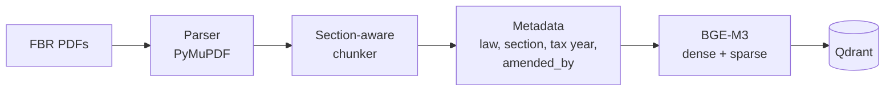
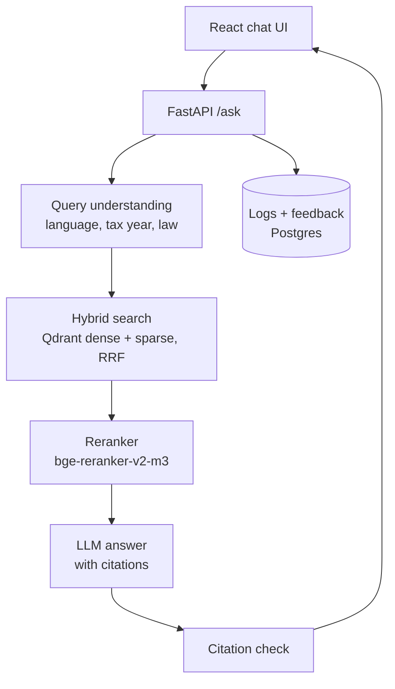

# Mahsool AI — محصول

**Cross-lingual RAG assistant for Pakistani tax law (FBR) — English, Urdu & Roman Urdu with section-level citations.**

Ask *"Mera tax kitna katega 1.5 lakh salary pe?"* or *"freelancer ko bahar se paisa aye to kitna tax?"* and get an
answer grounded in the Income Tax Ordinance, with every claim citing the exact section, clause or rate table it came
from. When the law doesn't cover the question, Mahsool says so.

> ⚠️ For information only, not tax advice. Confirm with a tax practitioner or FBR.


<sub>_Demo GIF coming in Milestone 5._</sub>

## Status

| Milestone | Scope | State |
| --- | --- | --- |
| 1 | Repo, ingestion of the Income Tax Ordinance 2001, 90 English eval questions | ✅ done |
| 2 | Income Tax Rules 2002 + WHT rate card, BGE-M3 → Qdrant, Urdu / Roman Urdu questions, baseline Recall@5 | ✅ done |
| 3 | Query rewrite, hybrid search + RRF, reranker, FastAPI `/ask` with citation check | ✅ built and evaluated · test set machine-verified (D45) · ⏳ end-to-end eval 68/179 test questions (Groq daily limit, D36) |
| 4 | React chat UI, citation cards, feedback, Postgres logs, Langfuse | |
| 5 | Fix top failures, Docker, deploy, demo | |

## Architecture

**Ingestion** (runs once per law, and again after every Finance Act):



**Answering a question** (Milestones 3–4):



## What's in the index today

All three phase-1 sources are the latest FBR versions; SHA-256 checksums are in
[`data/sources.manifest.json`](data/sources.manifest.json).

| Source | FBR version | Units covered | Chunks |
| --- | --- | --- | --- |
| Income Tax Ordinance, 2001 | amended up to 30.06.2026 (Finance Act 2026, TY2027) | 380 / 380 sections + all 15 Schedules | 885 |
| Income Tax Rules, 2002 | amended up to 15.09.2026 | 381 / 381 rules (form appendices skipped) | 498 |
| Withholding Tax Rates Card | TY2027, updated to 30.06.2026 | 29 sections, ATL and non-ATL rates | 33 |

"Units covered" is checked against each PDF's own table of contents. Chunks are at most 800 tokens; 899 carry
amendment history (`amended_by`: Finance Acts, SROs).

Each chunk follows the law's own structure: one section, one Second Schedule clause or one rate table. Example:

```json
{
  "chunk_id": "ITO2001-s149",
  "section_id": "ITO2001-s149",
  "law": "Income Tax Ordinance, 2001",
  "section": "149",
  "title": "Salary",
  "chapter": "Chapter X – Procedure",
  "part": "Part V; Division III: Deduction of Tax at Source",
  "amended_by": ["Finance Act, 2025", "Finance Act, 2024", "…"],
  "tax_year_from": 2027,
  "page": 333,
  "version_date": "2026-06-30",
  "text": "149. Salary. — (1) Every [person responsible for] paying salary to an employee shall …"
}
```

## Evaluation

The test set lives in [`eval/testset.jsonl`](eval/testset.jsonl). Every question has gold section IDs, a short
reference answer written only from the law text, a difficulty tag and a fixed dev/test split. All questions start with
`"verified": false`.

**How the test set is verified:** machine-verified by an independent LLM judge (Qwen) plus an automatic number check;
a second judge (Gemini) agreed on 15 of 15 it checked; 30 questions reviewed by a tax professional (pending).

All 239 questions are `"verified": "machine"`: in [`eval/verify_testset.py`](eval/verify_testset.py) Qwen reads only
the gold law text and confirms that it answers the question and supports the reference answer, and code checks that
every number in the reference answer is in the law text. Gemini 3 Flash, a different model family, runs the same
check as a non-blocking second opinion as far as its free tier allows (20 a day; `"second_opinion"` in the test set,
agreement rate in [`eval/FLAGGED.md`](eval/FLAGGED.md)). Neither model wrote the questions. None of this replaces an
expert: a stratified sample of 30 test questions waits for a tax professional
([`eval/expert_sample.json`](eval/expert_sample.json)). Decisions D38, D42, D43, D45.

| Group | Questions | Split (dev / test) |
| --- | --- | --- |
| English | 90 | 27 / 63 |
| Urdu script | 40 | 12 / 28 |
| Roman Urdu | 40 | 12 / 28 |
| English, from FBR pages (D39) | 39 | 0 / 39 |
| Out of scope / trick | 30 | 9 / 21 |
| **Total** | **239** | **60 / 179** |

Urdu and Roman Urdu questions are natural rewrites of English ones and share their gold sections and split.

**Retrieval ablation: Hit@5 on the held-out test split** (Urdu / Roman Urdu is the target group)


| Setup | English (written, 63) | English (FBR pages, 39) | Urdu (28) | Roman Urdu (28) | **All (158)** |
| --- | --- | --- | --- | --- | --- |
| BM25 keywords (no model) | 87.3% | 71.8% | 3.6% | 50.0% | 62.0% |
| BGE-M3 sparse only | 92.1% | 84.6% | 7.1% | 60.7% | 69.6% |
| Dense only (BGE-M3), original query | 98.4% | 79.5% | 78.6% | 57.1% | 82.9% |
| + sparse (hybrid, RRF) — **baseline** | 95.2% | 87.2% | 78.6% | 67.9% | 85.4% |
| + direct section lookup (in every row below) | 96.8% | 87.2% | 78.6% | 67.9% | 86.1% |
| + reranker (bge-reranker-v2-m3, top 30), no rewrite | 96.8% | 87.2% | 89.3% | 64.3% | 87.3% |
| + English query rewrite (GPT OSS 20B), no reranker | **98.4%** | 84.6% | **100%** | 89.3% | **93.7%** |
| + rewrite + reranker | 96.8% | **89.7%** | 89.3% | 75.0% | 89.9% |
| + glossary in rewrite = full pipeline, reranking with the question only | 96.8% | **89.7%** | 92.9% | 75.0% | 90.5% |
| full pipeline, reranking with max(question, rewrite) score = **`/ask` default** (D40) | 96.8% | 87.2% | 92.9% | **92.9%** | 93.0% |

All 158 in-scope test questions, re-run on 2026-09-25 after the chunk-title fix (D37): the written English, Urdu
and Roman Urdu numbers match the earlier runs except "+ reranker, no rewrite" (Urdu 92.9% → 89.3%) and
"+ rewrite + reranker" (Roman Urdu 71.4% → 75.0%). The `/ask` default has Recall@5 (all gold) 91.8% and MRR@10 0.863
on all 158. The FBR-sourced questions (D39) are the hardest English group: 87.2% with the default, 89.7% without
the max-score reranking.

The rewrite is the big win (Roman Urdu 67.9% → 89.3%). The reranker then undoes part of it for Urdu and Roman Urdu:
it scores chunks against the original question, which it reads poorly in Roman Urdu. Letting the reranker also score
the English rewrite and keep the higher score (`full-max`, last row) fixes most of that. It was chosen on the dev
split (Hit@5 96.1% vs 94.1%, Roman Urdu 83.3% vs 75.0%) and is now the `/ask` default
([D40](docs/DECISIONS.md)); it doubles the reranker time, which is the open latency problem for Milestone 5.

**Hybrid baseline, test split (the 119 written in-scope questions; with the 39 FBR questions, 158: Hit@5 85.4%):**

| Group | n | Hit@5 ("Recall@5") | Recall@5 (all gold) | MRR@10 |
| --- | --- | --- | --- | --- |
| English | 63 | 95.2% | 94.4% | 0.861 |
| Urdu script | 28 | 78.6% | 71.4% | 0.693 |
| Roman Urdu | 28 | 67.9% | 64.3% | 0.617 |
| **All** | 119 | **84.9%** | **81.9%** | **0.764** |

Metric definitions are in [DECISIONS D19](docs/DECISIONS.md). English numbers are optimistic because the questions
were written from the section text (D20). All questions are machine-verified (Qwen + number check); none is verified by
a tax professional yet (D45). Full reports, with every miss:
[`eval/reports/`](eval/reports/).

**Targets (held-out test split only)**

| Metric | Target | Result |
| --- | --- | --- |
| Retrieval Recall@5 (Urdu / Roman Urdu) | ≥ 80% | `/ask` default (full-max): Urdu 92.9% ✅ / Roman Urdu 92.9% ✅; all 158: 93.0%, FBR 87.2% |
| Answer correctness | ≥ 85% | not scored yet: needs a judge and verified reference answers (D35) |
| Answers with a correct citation | ≥ 90% | 98.2% of answered in-scope questions (54 of 55; 96.4% of the 55 run; FBR 1 of 1) — partial* |
| Correct refusal on out-of-scope questions | ≥ 90% | 13 / 13 run — partial*, and the 8 not run are the harder ones |

\* End-to-end on the test split ([`eval/run_e2e.py`](eval/run_e2e.py)) with the `/ask` default (full-max) covered
**68 of 179** questions before Groq's free-tier limit of 200k tokens a day on GPT OSS 120B stopped it (D36): 53 of
63 written English, 1 of 39 FBR, 1 of 28 Urdu, 0 of 28 Roman Urdu, 13 of 21 out-of-scope. 111 are left; at ~65
answers a day that is two more days. Re-running `python -m eval.run_e2e --split test` resumes from the cache.
Report: [`eval/reports/2026-09-25-e2e-test.md`](eval/reports/2026-09-25-e2e-test.md).
| Median latency | < 4 s | _Milestone 4_ |

## Run locally (no Docker)

Requires Python 3.11+ and about 5 GB of free disk (PyTorch + 2.3 GB of BGE-M3 weights). Everything runs
in-process: Qdrant is **embedded** (stored under `data/qdrant/`), so no Docker and no server are needed.

```bash
git clone https://github.com/hamzabilal000/mahsool.ai.git && cd mahsool.ai
python -m venv .venv && source .venv/bin/activate    # Windows: .venv\Scripts\activate
pip install torch --index-url https://download.pytorch.org/whl/cpu   # optional: CPU-only PyTorch, ~2 GB smaller
pip install -e ".[dev,ml]"          # drop ",ml" if you only want BM25, tests and the validator
cp .env.example .env                # keep QDRANT_URL empty = embedded Qdrant
sh scripts/setup-hooks.sh           # commit-msg hook (contributors only)

# 1. Build the vector index: downloads BGE-M3 on first run, then embeds all 1,416 chunks
#    (dense + sparse). ~35 min on a 4-core laptop CPU; re-run only when chunks change.
python -m ingestion.index

# 2. Evaluate retrieval on the held-out test split (reports go to eval/reports/)
python -m eval.run_eval --retriever bm25   --split test
python -m eval.run_eval --retriever dense  --split test
python -m eval.run_eval --retriever sparse --split test
python -m eval.run_eval --retriever hybrid --split test

# 3. Checks
python -m eval.validate_testset
ruff check . && pytest
```

The processed chunks are committed, so tests, the validator and the BM25 baseline run without downloading
anything. Only one process can open the embedded Qdrant folder at a time, so don't run `ingestion.index` and
`eval.run_eval` side by side.

**Ask questions through the API** (needs the index, and `GROQ_API_KEY` in `.env` from
[console.groq.com](https://console.groq.com) → API Keys). The test-set judge also needs `GEMINI_API_KEY` from
[aistudio.google.com](https://aistudio.google.com) → Get API key. Which provider and model serves each role
(answer, rewrite, judge 1, judge 2) is set in [`backend/app/config.py`](backend/app/config.py) (DECISIONS D42):

```bash
uvicorn backend.app.main:app --port 8000        # first start loads BGE-M3 + reranker (~30 s)
curl -s localhost:8000/ask -H 'content-type: application/json' \
  -d '{"question": "non filer hun, bank se cash nikalwaun to kitna tax katega?"}'
```

Interactive docs at http://localhost:8000/docs. Every response is
`{"success": …, "data": {answer, citations, sources, …}, "error": …, "code": "OK" | "REFUSED" | …}`.
On a laptop CPU the reranker makes each answer slow (tens of seconds); see DECISIONS D26.

**Ablation presets:** `python -m eval.run_eval --pipeline {lookup, lookup-rerank, rewrite, rewrite-rerank, full, full-max}
--split test`, then `python -m eval.plot_ablation` for the chart. End to end: `python -m eval.run_e2e --split test`.
LLM and reranker outputs are cached in `eval/cache/`, so re-runs are fast and reproducible without a key.

**Postgres** (conversation logs and feedback, needed from Milestone 4): create a free project on
[Neon](https://neon.tech) and paste its connection string into `DATABASE_URL` in `.env`.

**Optional:** [`docker-compose.yml`](docker-compose.yml) starts a local Qdrant server and Postgres if you'd rather
use Docker. Set `QDRANT_URL=http://localhost:6333` to point at it.

**Re-running ingestion from the FBR PDFs** (only needed when FBR publishes a new version):

```bash
python -m ingestion.download --law ITO2001 --check-latest   # exits 2 if FBR has a newer version
python -m ingestion.download --law ITO2001                  # skips the download if unchanged
python -m ingestion.parse    --law ITO2001
python -m ingestion.chunk    --law ITO2001                  # repeat for ITR2002
python -m ingestion.download --law WHT2027 && python -m ingestion.ratecard --law WHT2027
python -m ingestion.spot_check --law ITR2002 --n 20
```

## Repository layout

```
ingestion/           download → parse → chunk → index; one config per law in ingestion/laws/; ratecard.py
backend/app/         main.py (FastAPI), api/ask.py, service.py (guardrails), config.py (all model ids)
backend/app/rag/     embedder, Qdrant store, BM25, RRF, retriever, lookup, query_rewrite, reranker,
                     pipeline, generator, citations
data/glossary_ur.csv Urdu / Roman Urdu → legal English glossary used by the query rewrite
eval/                testset.jsonl (200 Qs), validator, run_eval.py (retrieval), run_e2e.py (/ask end to end),
                     plot_ablation.py, REVIEW.md checklist, reports/, cache/
data/processed/      committed chunks, coverage report and spot-check sample per law snapshot
data/sources.manifest.json   URL, version date and SHA-256 of every source PDF
tests/               unit tests + regression tests on the real outputs
docs/                LEARNING.md (concepts explained), DECISIONS.md (deviations from the plan)
docker-compose.yml   optional local Qdrant server + Postgres (not needed to run)
scripts/             commit-msg hook and setup-hooks.sh
frontend/            React app (Milestone 4)
```

## Docs

- [`docs/LEARNING.md`](docs/LEARNING.md): how each part works and why, in plain English.
- [`docs/DECISIONS.md`](docs/DECISIONS.md): every deviation from the project plan and the reason for it.
