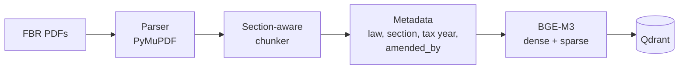
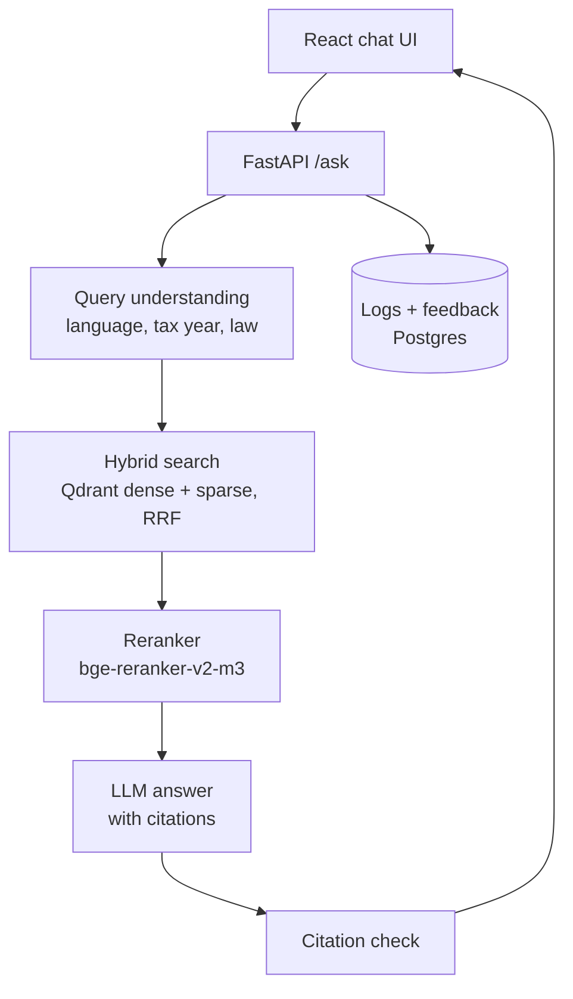

# Mahsool AI — محصول

**Cross-lingual RAG assistant for Pakistani tax law (FBR) — English, Urdu & Roman Urdu with section-level citations.**

Ask *"Mera tax kitna katega 1.5 lakh salary pe?"* or *"freelancer ko bahar se paisa aye to kitna tax?"* and get an
answer grounded in the Income Tax Ordinance, with every claim citing the exact section, clause or rate table it came
from. When the law doesn't cover the question, Mahsool says so.

> ⚠️ For information only, not tax advice. Confirm with a tax practitioner or FBR.


<sub>_Demo GIF coming in Milestone 5._</sub>

## Status

| Milestone | Scope | State |
| --- | --- | --- |
| 1 | Repo, ingestion of the Income Tax Ordinance 2001, 90 English eval questions | ✅ done |
| 2 | Income Tax Rules 2002 + WHT rate card, BGE-M3 → Qdrant, Urdu / Roman Urdu questions, baseline Recall@5 | ✅ BM25 baseline · ⏳ BGE-M3 run pending model download |
| 3 | Query rewrite, hybrid search + RRF, reranker, FastAPI `/ask` with citation check | |
| 4 | React chat UI, citation cards, feedback, Postgres logs, Langfuse | |
| 5 | Fix top failures, Docker, deploy, demo | |

## Architecture

**Ingestion** (runs once per law, and again after every Finance Act):



**Answering a question** (Milestones 3–4):



## What's in the index today

All three phase-1 sources are the latest FBR versions; SHA-256 checksums are in
[`data/sources.manifest.json`](data/sources.manifest.json).

| Source | FBR version | Units covered | Chunks |
| --- | --- | --- | --- |
| Income Tax Ordinance, 2001 | amended up to 30.06.2026 (Finance Act 2026, TY2027) | 380 / 380 sections + all 15 Schedules | 885 |
| Income Tax Rules, 2002 | amended up to 15.09.2026 | 381 / 381 rules (form appendices skipped) | 498 |
| Withholding Tax Rates Card | TY2027, updated to 30.06.2026 | 29 sections, ATL and non-ATL rates | 33 |

"Units covered" is checked against each PDF's own table of contents. Chunks are at most 800 tokens; 899 carry
amendment history (`amended_by`: Finance Acts, SROs).

Each chunk follows the law's own structure: one section, one Second Schedule clause or one rate table. Example:

```json
{
  "chunk_id": "ITO2001-s149",
  "section_id": "ITO2001-s149",
  "law": "Income Tax Ordinance, 2001",
  "section": "149",
  "title": "Salary",
  "chapter": "Chapter X – Procedure",
  "part": "Part V; Division III: Deduction of Tax at Source",
  "amended_by": ["Finance Act, 2025", "Finance Act, 2024", "…"],
  "tax_year_from": 2027,
  "page": 333,
  "version_date": "2026-06-30",
  "text": "149. Salary. — (1) Every [person responsible for] paying salary to an employee shall …"
}
```

## Evaluation

The test set lives in [`eval/testset.jsonl`](eval/testset.jsonl). Every question has gold section IDs, a short
reference answer written only from the law text, a difficulty tag and a fixed dev/test split. All questions start with
`"verified": false` and are checked by hand against the PDF before they are used for reporting.

| Group | Questions | Split (dev / test) |
| --- | --- | --- |
| English | 90 | 27 / 63 |
| Urdu script | 40 | 12 / 28 |
| Roman Urdu | 40 | 12 / 28 |
| Out of scope / trick | 30 | 9 / 21 |
| **Total** | **200** | **60 / 140** |

Urdu and Roman Urdu questions are natural rewrites of English ones and share their gold sections and split.

**Retrieval ablation: Hit@5 on the held-out test split** (Urdu / Roman Urdu is the target group)

| Setup | English | Urdu | Roman Urdu |
| --- | --- | --- | --- |
| BM25 keywords (no model) | 87.3% | 3.6% | 50.0% |
| Dense only (BGE-M3), original query | _pending_ | _pending_ | _pending_ |
| + sparse (hybrid, RRF) | _pending_ | _pending_ | _pending_ |
| + English query rewrite | _M3_ | _M3_ | _M3_ |
| + reranker | _M3_ | _M3_ | _M3_ |
| + glossary in rewrite | _M3_ | _M3_ | _M3_ |

The English BM25 number is optimistic because the questions were written from the section text (see
[DECISIONS D20](docs/DECISIONS.md)). Full reports: [`eval/reports/`](eval/reports/).

**Targets (held-out test split only)**

| Metric | Target | Result |
| --- | --- | --- |
| Retrieval Recall@5 (Urdu / Roman Urdu) | ≥ 80% | BM25: 3.6% / 50.0%; BGE-M3 pending |
| Answer correctness | ≥ 85% | _Milestone 3_ |
| Answers with a correct citation | ≥ 90% | _Milestone 3_ |
| Correct refusal on out-of-scope questions | ≥ 90% | _Milestone 3_ |
| Median latency | < 4 s | _Milestone 4_ |

## Setup

Requires Python 3.11+.

```bash
git clone https://github.com/hamzabilal000/mahsool.ai.git && cd mahsool.ai
python -m venv .venv && source .venv/bin/activate
pip install -e ".[dev]"            # add ",ml" for BGE-M3 (PyTorch + ~2.3 GB of model weights)
cp .env.example .env

# Ingestion (repeat per law: ITO2001, ITR2002; the rate card uses its own parser)
python -m ingestion.download --law ITO2001 --check-latest   # exits 2 if FBR has a newer version
python -m ingestion.download --law ITO2001                  # skips the download if unchanged
python -m ingestion.parse    --law ITO2001
python -m ingestion.chunk    --law ITO2001
python -m ingestion.download --law WHT2027 && python -m ingestion.ratecard --law WHT2027
python -m ingestion.spot_check --law ITR2002 --n 20

# Vector index (needs the ml extra). Qdrant: docker compose up -d, or leave QDRANT_URL empty for embedded mode
python -m ingestion.index

# Evaluation
python -m eval.validate_testset
python -m eval.run_eval --retriever bm25   --split test
python -m eval.run_eval --retriever hybrid --split test     # dense / sparse / hybrid need the index
ruff check . && pytest
```

The processed chunks are committed, so tests, the validator and the BM25 baseline run without downloading anything.

## Repository layout

```
ingestion/           download → parse → chunk → index; one config per law in ingestion/laws/; ratecard.py
backend/app/         config.py (all model ids) and rag/: embedder, Qdrant store, BM25, RRF fusion, retriever
eval/                testset.jsonl (200 Qs), schema, validator, metrics, run_eval.py, reports/
data/processed/      committed chunks, coverage report and spot-check sample per law snapshot
data/sources.manifest.json   URL, version date and SHA-256 of every source PDF
tests/               unit tests + regression tests on the real outputs
docs/                LEARNING.md (concepts explained), DECISIONS.md (deviations from the plan)
docker-compose.yml   Qdrant + Postgres (backend joins in Milestone 3)
frontend/            React app (Milestone 4)
```

## Docs

- [`docs/LEARNING.md`](docs/LEARNING.md): how each part works and why, in plain English.
- [`docs/DECISIONS.md`](docs/DECISIONS.md): every deviation from the project plan and the reason for it.
