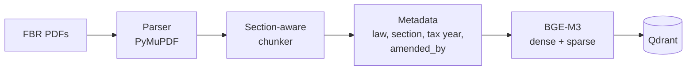
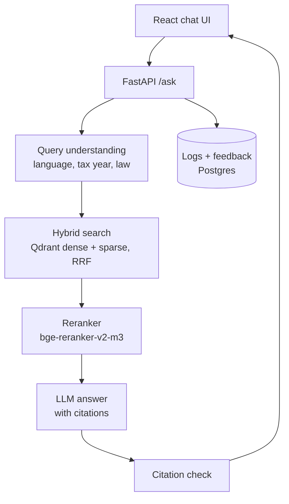
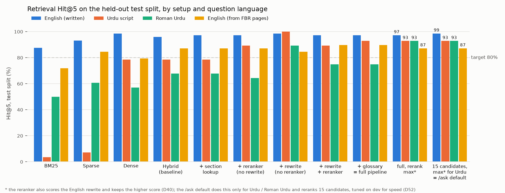

# Mahsool AI — محصول

**Cross-lingual RAG assistant for Pakistani tax law (FBR) — English, Urdu & Roman Urdu with section-level citations.**

Ask *"Mera tax kitna katega 1.5 lakh salary pe?"* or *"freelancer ko bahar se paisa aye to kitna tax?"* and get an
answer grounded in the Income Tax Ordinance, with every claim citing the exact section, clause or rate table it came
from. When the law doesn't cover the question, Mahsool says so.

> ⚠️ For information only, not tax advice. Confirm with a tax practitioner or FBR.


<sub>_Demo GIF coming in Milestone 5._</sub>

## Status

| Milestone | Scope | State |
| --- | --- | --- |
| 1 | Repo, ingestion of the Income Tax Ordinance 2001, 90 English eval questions | ✅ done |
| 2 | Income Tax Rules 2002 + WHT rate card, BGE-M3 → Qdrant, Urdu / Roman Urdu questions, baseline Recall@5 | ✅ done |
| 3 | Query rewrite, hybrid search + RRF, reranker, FastAPI `/ask` with citation check | ✅ built and evaluated · test set verified: 248 of 249 (D45, D51) · ⏳ end-to-end eval 50/189 (Groq daily limit, D36) |
| 4 | React chat UI, citation cards, feedback, Postgres logs, eval page | ✅ done (Langfuse moved to M5, D49) |
| 5 | Fix top failures, Docker, deploy, demo | 🔄 in progress: latency 44 → 16 s (D52), definition lookup (D57), rate tables in citation cards, free-tier safeguards (D53), deploy prepared, not live (D54) |

## Architecture

**Ingestion** (runs once per law, and again after every Finance Act):



**Answering a question** (Milestones 3–4):



## What's in the index today

All three phase-1 sources are the latest FBR versions; SHA-256 checksums are in
[`data/sources.manifest.json`](data/sources.manifest.json).

| Source | FBR version | Units covered | Chunks |
| --- | --- | --- | --- |
| Income Tax Ordinance, 2001 | amended up to 30.06.2026 (Finance Act 2026, TY2027) | 380 / 380 sections + all 15 Schedules | 885 |
| Income Tax Rules, 2002 | amended up to 15.09.2026 | 381 / 381 rules (form appendices skipped) | 498 |
| Withholding Tax Rates Card | TY2027, updated to 30.06.2026 | 29 sections, ATL and non-ATL rates | 33 |

"Units covered" is checked against each PDF's own table of contents. Chunks are at most 800 tokens; 899 carry
amendment history (`amended_by`: Finance Acts, SROs).

Each chunk follows the law's own structure: one section, one Second Schedule clause or one rate table. Example:

```json
{
  "chunk_id": "ITO2001-s149",
  "section_id": "ITO2001-s149",
  "law": "Income Tax Ordinance, 2001",
  "section": "149",
  "title": "Salary",
  "chapter": "Chapter X – Procedure",
  "part": "Part V; Division III: Deduction of Tax at Source",
  "amended_by": ["Finance Act, 2025", "Finance Act, 2024", "…"],
  "tax_year_from": 2027,
  "page": 333,
  "version_date": "2026-06-30",
  "text": "149. Salary. — (1) Every [person responsible for] paying salary to an employee shall …"
}
```

## Evaluation

The test set lives in [`eval/testset.jsonl`](eval/testset.jsonl). Every question has gold section IDs, a short
reference answer written only from the law text, a difficulty tag and a fixed dev/test split. All questions start with
`"verified": false`.

**How the test set is verified:** machine-verified by an independent LLM judge (Qwen) plus an automatic number check;
a second judge (Gemini) agreed on 19 of 21 it checked with the current three-question prompt (the 2 disagreements concern tax-year-2022 provisos that do not apply to TY2027). Legal review of a 30-question sample by ChatGPT (OpenAI), an AI legal-review tool with web access,
26 Sep 2026: 19 correct, 10 partly correct, 1 wrong; all fixed and a completeness sweep applied to the full set. This
is an AI tool's review, not a human one; a review by a tax professional is still pending.

In [`eval/verify_testset.py`](eval/verify_testset.py) Qwen reads only the gold law text and answers three questions:
does it answer the question, does it support the reference answer, and does the reference omit a condition or
exception that changes the answer (added after the review showed that the judges passed incomplete answers, D51).
Code checks that every number in the reference answer is in the law text. Gemini 3 Flash, a different model family,
runs the same check as a non-blocking second opinion as far as its free tier allows (20 a day). Neither model wrote
the questions. Every correction from the review was checked against the corpus before it was applied, and every
change to a reference answer is listed with before and after in [`eval/FLAGGED.md`](eval/FLAGGED.md) (D50).

**Current state (2026-09-26):** 248 of 249 questions are machine-verified (30 of them also "reviewed": marked correct
or corrected per the AI review, then re-verified). The one left, en-092 (rent paid by a company to an individual
landlord), is flagged by Qwen: whether Division V's rates depend on the landlord or the tenant is not stated in the
corpus, so it waits for the tax-practitioner review instead of a guess. Decisions D38, D42, D45, D50, D51.

| Group | Questions | Split (dev / test) |
| --- | --- | --- |
| English | 100 | 27 / 73 |
| Urdu script | 40 | 12 / 28 |
| Roman Urdu | 40 | 12 / 28 |
| English, from FBR pages (D39) | 39 | 0 / 39 |
| Out of scope / trick | 30 | 9 / 21 |
| **Total** | **249** | **60 / 189** |

Urdu and Roman Urdu questions are natural rewrites of English ones and share their gold sections and split.

**Retrieval ablation: Hit@5 on the held-out test split** (Urdu / Roman Urdu is the target group)



| Setup | English (written, 73) | English (FBR pages, 39) | Urdu (28) | Roman Urdu (28) | **All (168)** |
| --- | --- | --- | --- | --- | --- |
| BM25 keywords (no model) | 87.7% | 71.8% | 3.6% | 50.0% | 63.7% |
| BGE-M3 sparse only | 93.2% | 84.6% | 7.1% | 60.7% | 71.4% |
| Dense only (BGE-M3), original query | 98.6% | 79.5% | 78.6% | 57.1% | 83.9% |
| + sparse (hybrid, RRF) — **baseline** | 95.9% | 87.2% | 78.6% | 67.9% | 86.3% |
| + direct section lookup (in every row below) | 97.3% | 87.2% | 78.6% | 67.9% | 86.9% |
| + reranker (bge-reranker-v2-m3, top 30), no rewrite | 97.3% | 87.2% | 89.3% | 64.3% | 88.1% |
| + English query rewrite (GPT OSS 20B), no reranker | **98.6%** | 84.6% | **100%** | 89.3% | **94.0%** |
| + rewrite + reranker | 97.3% | **89.7%** | 89.3% | 75.0% | 90.5% |
| + glossary in rewrite = full pipeline, reranking with the question only | 97.3% | **89.7%** | 92.9% | 75.0% | 91.1% |
| full pipeline, reranking with max(question, rewrite) score (D40) | 97.3% | 87.2% | 92.9% | **92.9%** | 93.5% |
| 15 rerank candidates, max score only for Urdu / Roman Urdu (D52) | **98.6%** | 87.2% | 92.9% | **92.9%** | 94.0% |
| + section 2 definition lookup = **`/ask` default** (D57) | **98.6%** | **94.9%** | 92.9% | **92.9%** | **95.8%** |

All 168 in-scope test questions, re-run on 2026-09-26 after the legal-review fixes and the 10 new condition-focused
English questions (en-091 … en-100, all 10 found in the top 5 by the default pipeline; D51). Reference-answer fixes
do not change retrieval; the written-English column moves only because of the new questions. The `/ask` default has
Recall@5 (all gold) 92.8% and MRR@10 0.906 on all 168. The last two rows are Milestone 5 changes: the reranker scores
15 candidates and uses the English rewrite only for Urdu / Roman Urdu (tuned on dev for speed, D52), and a definition
lookup pins the section 2 clause for "what is X?" questions (D57), which lifts the FBR-sourced group (D39) from 87.2%
to 94.9%. That rule was found by reading test misses (the FBR questions exist only on the test split), so part of
that gain is in-sample; dev was unchanged by it.

The rewrite is the big win (Roman Urdu 67.9% → 89.3%). The reranker then undoes part of it for Urdu and Roman Urdu:
it scores chunks against the original question, which it reads poorly in Roman Urdu. Letting the reranker also score
the English rewrite and keep the higher score (`full-max`, last row) fixes most of that. It was chosen on the dev
split (Hit@5 96.1% vs 94.1%, Roman Urdu 83.3% vs 75.0%) and is now the `/ask` default
([D40](docs/DECISIONS.md)); it doubles the reranker time, which is the open latency problem for Milestone 5.

**Hybrid baseline from Milestone 2, test split (the 119 written in-scope questions of that time; on today's 168: Hit@5 86.3%):**

| Group | n | Hit@5 ("Recall@5") | Recall@5 (all gold) | MRR@10 |
| --- | --- | --- | --- | --- |
| English | 63 | 95.2% | 94.4% | 0.861 |
| Urdu script | 28 | 78.6% | 71.4% | 0.693 |
| Roman Urdu | 28 | 67.9% | 64.3% | 0.617 |
| **All** | 119 | **84.9%** | **81.9%** | **0.764** |

Metric definitions are in [DECISIONS D19](docs/DECISIONS.md). English numbers are optimistic because the questions
were written from the section text (D20). 248 of 249 questions are machine-verified (D51); a 30-question sample
was checked by an AI legal-review tool, and none by a tax professional yet (D50). Full reports, with every miss:
[`eval/reports/`](eval/reports/).

**Targets (held-out test split only)**

| Metric | Target | Result |
| --- | --- | --- |
| Retrieval Recall@5 (Urdu / Roman Urdu) | ≥ 80% | `/ask` default: Urdu 92.9% ✅ / Roman Urdu 92.9% ✅; all 168: 95.8%, FBR 94.9% |
| Answer correctness | ≥ 85% | 97.3% of the 37 answers judged so far match the reference (Qwen judge, D56; 36 English + 1 FBR, no Urdu yet) — partial* |
| Answers with a correct citation | ≥ 90% | 37 of 37 in-scope questions run so far answered with a correct citation — partial* |
| Correct refusal on out-of-scope questions | ≥ 90% | 13 / 13 run — partial*, and the 8 not run are the harder ones |
| Median latency | < 4 s | ❌ ~18 s p50 for a new question on 4 CPU cores (rerank 15 s, retrieval 0.7 s, both LLMs ~2 s, D52); ~30 ms for a repeated question (answer cache) |

\* End-to-end on the test split ([`eval/run_e2e.py`](eval/run_e2e.py)) with the `/ask` default. The answer prompt
changed on 2026-09-26 (it must state conditions and both ATL and non-ATL rates, D51), so the run restarted: **50 of
189 run, 139 left** after the second daily quota (37 in-scope answers, all citing a gold section; 13 out-of-scope,
all refused), at ~40-65 answers a day on Groq's free tier (D36). The 50 are the first questions in file order, so
almost all are written English: no Urdu or Roman Urdu answer has been scored with the current prompt yet. The
previous prompt's run (85 of 179: 70 of 71 answered with a correct citation) is kept in D44. Resume:
`python -m eval.run_e2e --split test`, then `python -m eval.judge_answers --split test` and, once 50 in-scope answers
exist, `python -m eval.make_answer_check`.
Report: [`eval/reports/2026-09-26-e2e-test.md`](eval/reports/2026-09-26-e2e-test.md).

## Run locally (no Docker)

Requires Python 3.11+ and about 5 GB of free disk (PyTorch + 2.3 GB of BGE-M3 weights). Everything runs
in-process: Qdrant is **embedded** (stored under `data/qdrant/`), so no Docker and no server are needed.

```bash
git clone https://github.com/hamzabilal000/mahsool.ai.git && cd mahsool.ai
python -m venv .venv && source .venv/bin/activate    # Windows: .venv\Scripts\activate
pip install torch --index-url https://download.pytorch.org/whl/cpu   # optional: CPU-only PyTorch, ~2 GB smaller
pip install -e ".[dev,ml]"          # drop ",ml" if you only want BM25, tests and the validator
cp .env.example .env                # keep QDRANT_URL empty = embedded Qdrant
sh scripts/setup-hooks.sh           # commit-msg hook (contributors only)

# 1. Build the vector index: downloads BGE-M3 on first run, then embeds all 1,416 chunks
#    (dense + sparse). ~35 min on a 4-core laptop CPU; re-run only when chunks change.
python -m ingestion.index

# 2. Evaluate retrieval on the held-out test split (reports go to eval/reports/)
python -m eval.run_eval --retriever bm25   --split test
python -m eval.run_eval --retriever dense  --split test
python -m eval.run_eval --retriever sparse --split test
python -m eval.run_eval --retriever hybrid --split test

# 3. Checks
python -m eval.validate_testset
ruff check . && pytest
```

The processed chunks are committed, so tests, the validator and the BM25 baseline run without downloading
anything. Only one process can open the embedded Qdrant folder at a time, so don't run `ingestion.index` and
`eval.run_eval` side by side.

**Ask questions through the API** (needs the index, and `GROQ_API_KEY` in `.env` from
[console.groq.com](https://console.groq.com) → API Keys). The test-set judge also needs `GEMINI_API_KEY` from
[aistudio.google.com](https://aistudio.google.com) → Get API key. Which provider and model serves each role
(answer, rewrite, judge 1, judge 2) is set in [`backend/app/config.py`](backend/app/config.py) (DECISIONS D42):

```bash
uvicorn backend.app.main:app --port 8000        # first start loads BGE-M3 + reranker (~30 s)
curl -s localhost:8000/ask -H 'content-type: application/json' \
  -d '{"question": "non filer hun, bank se cash nikalwaun to kitna tax katega?"}'
```

Interactive docs at http://localhost:8000/docs. Every response is
`{"success": …, "data": {answer, citations, sources, …}, "error": …, "code": "OK" | "REFUSED" | …}`.
On a laptop CPU the reranker makes each answer slow (tens of seconds); see DECISIONS D26.

**Ablation presets:** `python -m eval.run_eval --pipeline {lookup, lookup-rerank, rewrite, rewrite-rerank, full, full-max}
--split test`, then `python -m eval.plot_ablation` for the chart. End to end: `python -m eval.run_e2e --split test`.
LLM and reranker outputs are cached in `eval/cache/`, so re-runs are fast and reproducible without a key.

**Chat UI** (Milestone 4; needs Node 20+ and the API above running on port 8000):

```bash
cd frontend
npm install
npm run dev                 # http://localhost:5173 — chat at /, evaluation page at /eval
npm test && npm run lint    # parser/format unit tests and oxlint
```

The UI calls the API at `VITE_API_URL` (default `http://localhost:8000`; see `frontend/.env.example`). Answers
stream in over `POST /ask/stream`; thumbs up/down go to `POST /feedback`. After new eval runs,
`python -m eval.summary` refreshes the numbers on the eval page.

**Question log and feedback:** stored in Postgres when `DATABASE_URL` is set (a free [Neon](https://neon.tech)
project's connection string works as is), otherwise in a local SQLite file, `data/mahsool.db`, so nothing else is
needed for development. Tables are created on startup; no IP address or user id is stored (D47).

**Optional:** [`docker-compose.yml`](docker-compose.yml) starts a local Qdrant server and Postgres if you'd rather
use Docker. Set `QDRANT_URL=http://localhost:6333` to point at it.

**Re-running ingestion from the FBR PDFs** (only needed when FBR publishes a new version):

```bash
python -m ingestion.download --law ITO2001 --check-latest   # exits 2 if FBR has a newer version
python -m ingestion.download --law ITO2001                  # skips the download if unchanged
python -m ingestion.parse    --law ITO2001
python -m ingestion.chunk    --law ITO2001                  # repeat for ITR2002
python -m ingestion.download --law WHT2027 && python -m ingestion.ratecard --law WHT2027
python -m ingestion.spot_check --law ITR2002 --n 20
```

## Deploy (prepared, not live yet)

The plan's free-tier setup (DECISIONS D54): the API on a free **Hugging Face Docker Space** (2 vCPU, 16 GB RAM),
the chat UI on **Vercel**, question logs, feedback and the answer cache on **Neon** Postgres. Nothing here costs
money; the answer model stays on Groq's free tier, so the demo has daily limits (below).

**1. Accounts and keys you need** (all free):

| Where | What to create | Where it goes |
| --- | --- | --- |
| [huggingface.co](https://huggingface.co) | an account and an access token with **write** access (Settings → Access Tokens) | `HF_TOKEN` in your shell, only for the upload |
| [neon.tech](https://neon.tech) | a project; copy its connection string | Space secret `DATABASE_URL` |
| [console.groq.com](https://console.groq.com) | the API key you already use | Space secret `GROQ_API_KEY` |
| [vercel.com](https://vercel.com) | an account linked to GitHub | imports `frontend/` |
| [cloud.langfuse.com](https://cloud.langfuse.com) | (step 5, not wired yet) a project; its public and secret keys | Space secrets `LANGFUSE_PUBLIC_KEY`, `LANGFUSE_SECRET_KEY`, `LANGFUSE_HOST` |

**2. Backend (Hugging Face Space).** Build the index once (`python -m ingestion.index`), then:

```bash
python scripts/deploy_space.py --dry-run                            # see what is uploaded (~23 MB)
HF_TOKEN=hf_... python scripts/deploy_space.py --space <your-hf-user>/mahsool-api
```

The script uploads the [`Dockerfile`](Dockerfile), the code, the committed chunks and the prebuilt index; the
Space builds the image (both models are baked in, ~4.5 GB) and serves on port 7860. In the Space's
**Settings → Variables and secrets** add `GROQ_API_KEY` and `DATABASE_URL` (secrets) and
`MAHSOOL_CORS_ORIGINS` = `["https://<your-app>.vercel.app"]` (variable). Check `https://<user>-mahsool-api.hf.space/health`.

**3. Frontend (Vercel).** New Project → import the GitHub repo → **Root Directory `frontend`** (Vite is detected;
[`frontend/vercel.json`](frontend/vercel.json) sends every route to the app) → environment variable
`VITE_API_URL` = `https://<user>-mahsool-api.hf.space` → Deploy.

**4. Keep it awake.** Free Spaces sleep after ~48 hours without visitors. Add the repository variable `SPACE_URL`
(GitHub → Settings → Secrets and variables → Actions → Variables); [`keepalive.yml`](.github/workflows/keepalive.yml)
then pings `/health` twice a day.

**Free-tier behaviour of the live demo (D53):** repeated questions are answered from the answer cache (no quota,
no reranking); each visitor can ask 20 new questions a day (`MAHSOOL_DAILY_QUESTIONS_PER_VISITOR`); when Groq's
daily quota is used up the app says so politely, in the question's language, instead of failing.

## Repository layout

```
ingestion/           download → parse → chunk → index; one config per law in ingestion/laws/; ratecard.py
backend/app/         main.py (FastAPI), api/ask.py (/ask, /ask/stream, /feedback), api/eval.py (eval page data),
                     service.py (guardrails), config.py (all model ids), db/ (question log + feedback)
backend/app/rag/     embedder, Qdrant store, BM25, RRF, retriever, lookup, query_rewrite, reranker,
                     pipeline, generator, citations
data/glossary_ur.csv Urdu / Roman Urdu → legal English glossary used by the query rewrite
eval/                testset.jsonl (239 Qs), validator, verify_testset.py, run_eval.py (retrieval), run_e2e.py
                     (/ask end to end), plot_ablation.py, summary.py (eval page), reports/, cache/
data/processed/      committed chunks, coverage report and spot-check sample per law snapshot
data/sources.manifest.json   URL, version date and SHA-256 of every source PDF
tests/               unit tests + regression tests on the real outputs
docs/                LEARNING.md (concepts explained), DECISIONS.md (deviations from the plan)
docker-compose.yml   optional local Qdrant server + Postgres (not needed to run)
scripts/             commit-msg hook and setup-hooks.sh
frontend/            React + Vite + Tailwind chat UI and eval page (src/Pages, src/components, src/api)
```

## Docs

- [`docs/LEARNING.md`](docs/LEARNING.md): how each part works and why, in plain English.
- [`docs/DECISIONS.md`](docs/DECISIONS.md): every deviation from the project plan and the reason for it.
